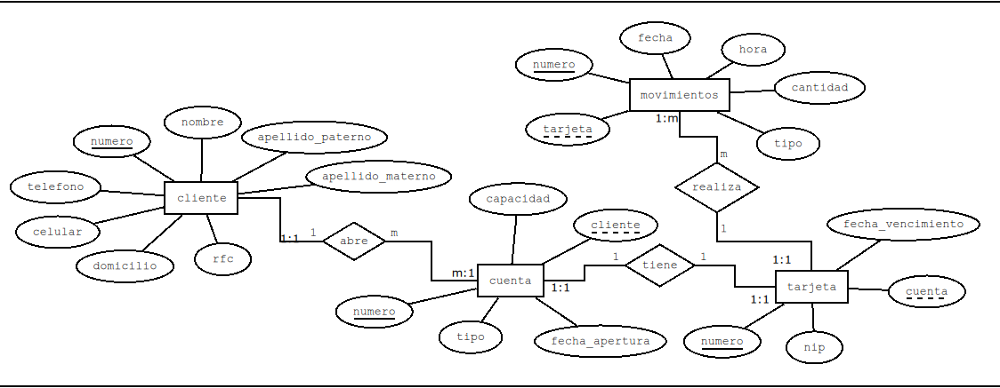
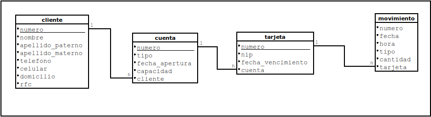

# BANK_SYSTEM

Sistema de cajero ATM con base de datos

1. [REQUERIMIENTOS](#requerimentos)
2. [BASE DE DATOS](#base-de-datos)
    1. [DIAGRAMAS](#diagramas)
    2. [DICCIONARIO DE DATOS](#diccionario-de-datos)
3. [DESARROLLO](#desarrollo)
    1. [CLONADO DE REPOSITORIO](#clonado-de-repositorio)
    2. [CREACION Y BASIADO DE LA BASE DE DATOS](#creacion-y-basiado-de-la-base-de-datos)

## REQUERIMENTOS

* DOCKER
* MYSQL
* JAVA
* M-V-C

## BASE DE DATOS

### DIAGRAMAS

**Diagrama**: Entidad-relacion



**Diagrama**: Relacional



### DICCIONARIO DE DATOS

**cliente**:  

|Columna|Tipo|Tamaño|Desicripcion|
|----|----|----|----|
|numero|entero|N/D|contendra el numero autogenerado|
|nombre|cadena|100|contendra el nombre del cliente|
|apellido_paterno|cadena|100|contendra el apellido paterno|
|apellido_materno|cadena|100|contendra el apellido materno|
|telefono|cadena|10|contendra el telefomo|
|celular|cadena|10|contendra el numero celular del cliente|
|domicilio|cadena|225|contendra el domicilio de la credencial del cliente|
|rfc|cadena|13|contendra la rfc del cliente|

---

**cuenta**:

|Columna|Tipo|Tamaño|Desicripcion|
|----|----|----|----|
|numero|entero|N/D|contendra el numero autogenerado|
|tipo|entero|1|contendra el tipo de la cuenta{1: debito, 2: credito,3: ahorro}|
|fecha_apertura|fecha|dd/MM/aaaa|contendra la fecha de apertura de la cuenta|
|capacidad|real|N/D|contendra la cantidad de  dinero disponible en la cuenta|
|cliente|entero|N/D|contendra el nombre del cliente asosiado a la cuenta|

---

**tarjeta**:

|Columna|Tipo|Tamaño|Desicripcion|
|----|----|----|----|
|numero|entero|16|contendra el numero autogenerado|
|nip|entero|sha1|contendra el nip cifrado|
|fecha_vencimiento|fecha|dd/MM/aaaa|contendra la fecha de vencimiento de la tarjeta|
|cuenta|entero|N/D|contendra el numero de cuenta de la tarjeta|

---

**movimiento**:

|Columna|Tipo|Tamaño|Desicripcion|
|----|----|----|----|
|numero|entero|N/D|contendra el numero autogenerado|
|fecha|fecha|dd/MM/aaaa|contendra la fecha del movimiento en la cuenta asociada a la tarjeta|
|hora|hora|HH:mm:ss|contendra la hora del movimiento en la cuenta asociada a la tarjeta|
|tipo|entero|1|debito{retiro, depocito} credito{ pago, apono}|
|cantidad|real|N/D|contendra de dinero en movimiento en la cuenta asociada a la tarjeta|
|tarjeta|entero|N/D|contendra el numero de tarjeta|

---

## DESARROLLO

### CLONADO DE REPOSITORIO

```console
    git clone https://github.com/EDISC/bank_system.git
```

## ARUQUITECTURA M-V-C

SISTEMA

### CREACION Y BASIADO DE LA BASE DE DATOS

1. SE CREARA EL CONTENEDOR DE MYSQL CON LA VERSION 8.0

    ```console
    docker pull mysql:8.0
    ```

    ```console
    docker create --name data -v (pwd)/sql:home/sql -p3306:330X -e MYSQL_ALLOW_EMPTY_PASSWORD=true mysql:8.0
    ```

    ```console
    docker start data
    ```

2. SE CREARA LA BASE DE DATOS

    ```console
    docker exec -it data bash
    ```

    ```console
    mysql -h localhost -u root -p 
    ```

    ```sql
    source /home/sql/ldd.sql 
    ```

3. SE REALIZARA EL BASIADO DE DATOS DESDE UN ARCHIVO `.csv`

    SE EJECUTARA EL SCRIPT DE PYTHON `dumper.py`

    ```console
    python dumper.py <tabla> <archivo.csv>
    ```
